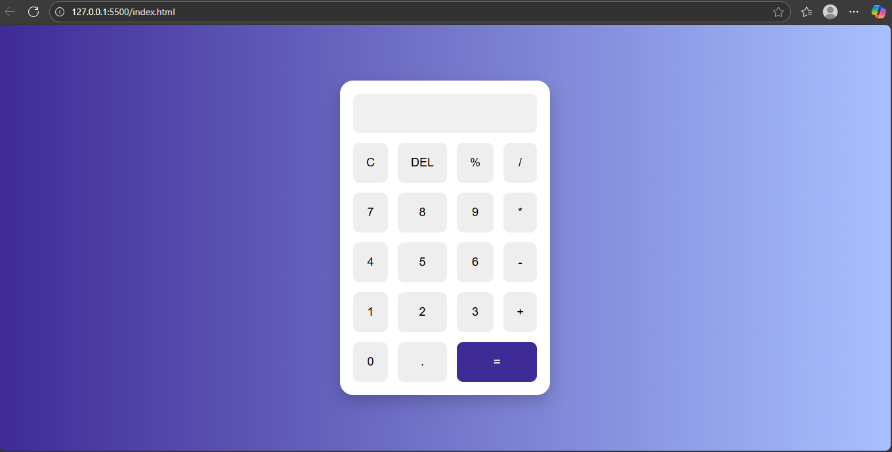

# 🧮 Stylish Calculator using HTML, CSS, JavaScript

This is a beautiful and functional calculator web app built using only HTML, CSS, and JavaScript. It supports basic arithmetic operations and has an attractive UI with hover effects and a clean layout.

## 🔧 Features

- Clean and attractive design
- Responsive layout
- Basic arithmetic operations: `+`, `-`, `*`, `/`, `%`
- Clear (`C`) and Delete (`DEL`) buttons
- Light hover effects on all buttons

## 📁 Tech Stack

- HTML
- CSS
- JavaScript (Vanilla)

## 🚀 How to Run

1. Clone or download this repository.
2. Open the folder in VS Code or any editor.
3. Open `index.html` with Live Server or directly in browser.

## 📸 Screenshot

> Screenshot of the final output is included as `screenshot.png`.

## 📚 Learnings

- DOM manipulation in JavaScript
- Event handling in buttons
- CSS Grid for layout
- Designing responsive UI

## 💡 Future Improvements

- Add dark/light theme toggle
- Add keyboard input support
- Add animation/sound on button press

---

Made with ❤️ by [Shraddha](https://github.com/Shraddha22464)
